# Write-Up : The Hunter, GreHack 2024 (Forensic)

## Step 1 - Spotting

After looking carefully through the VM's files, software, etc., we can see in Burp Suite that there are some "unusual" extensions, including a custom one named "dotGit". Let's dive into it.    
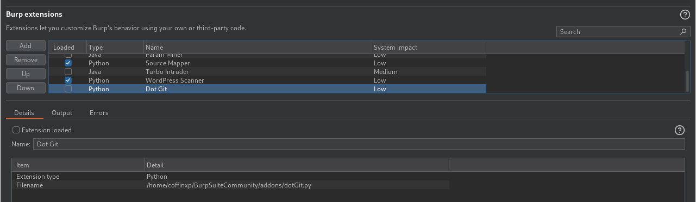

## Step 2 - dotGit.py

Looking through this Python file, we find some weird lines ...   
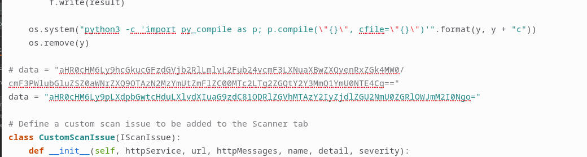

Very interesting :)  
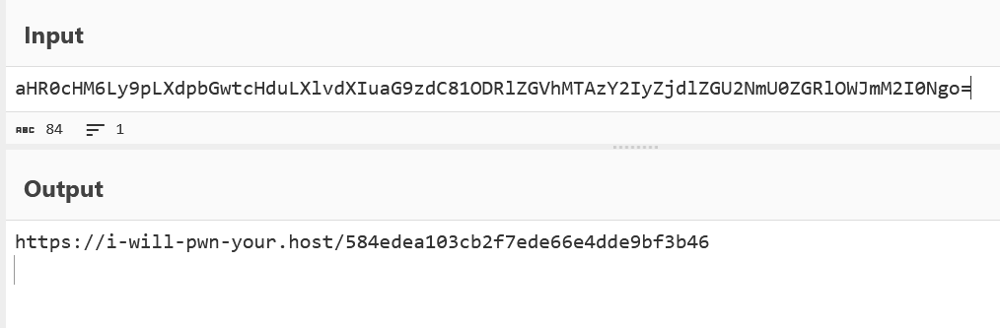

Also, this is very suspicious :   
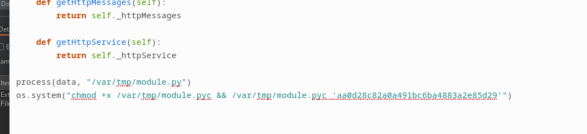

Let's look at this module.pyc file closer.


## Step 3 -  module.pyc & module.py

We need a Python decompiler to handle this new file. ```pycdc``` will do the job. (https://github.com/zrax/pycdc)   
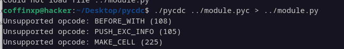

Then, looking at ```module.py```, we understand that we are dealing with an AES encryption scheme. The malware exfiltrates files by sending them to a Discord channel.  
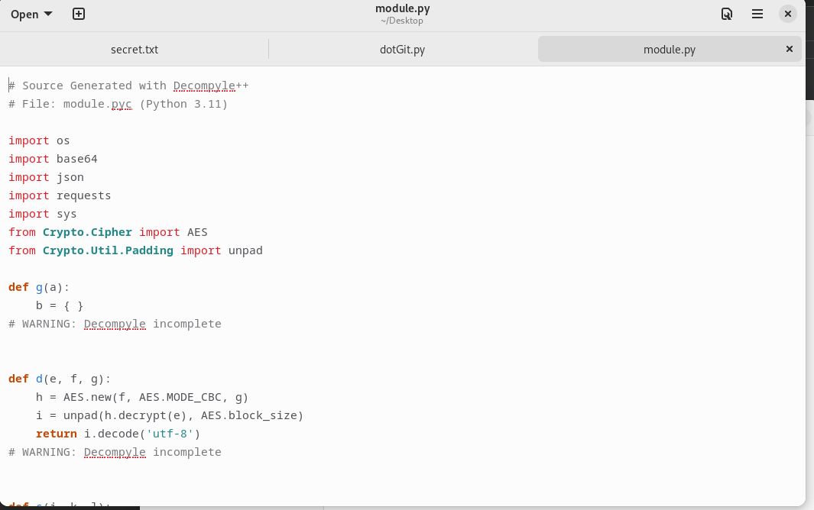  
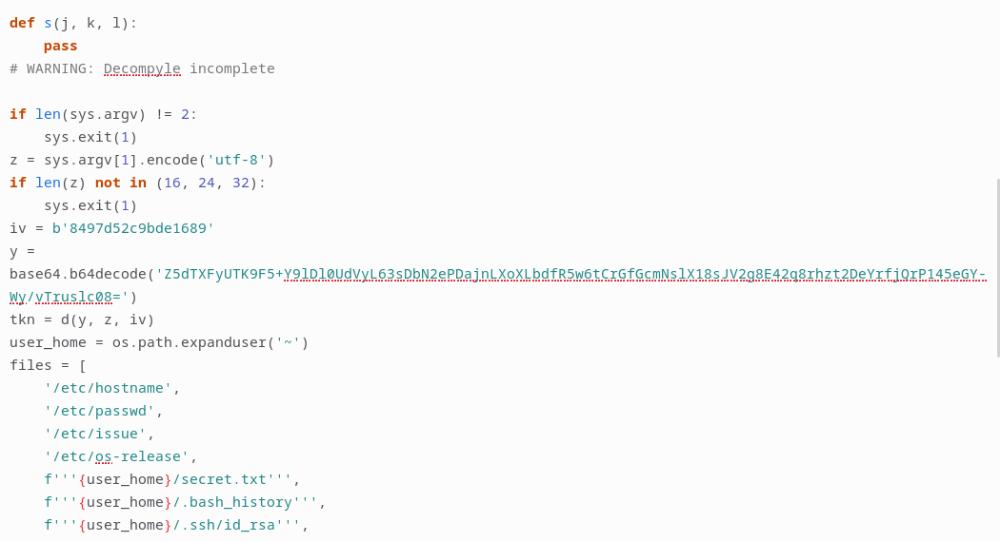  
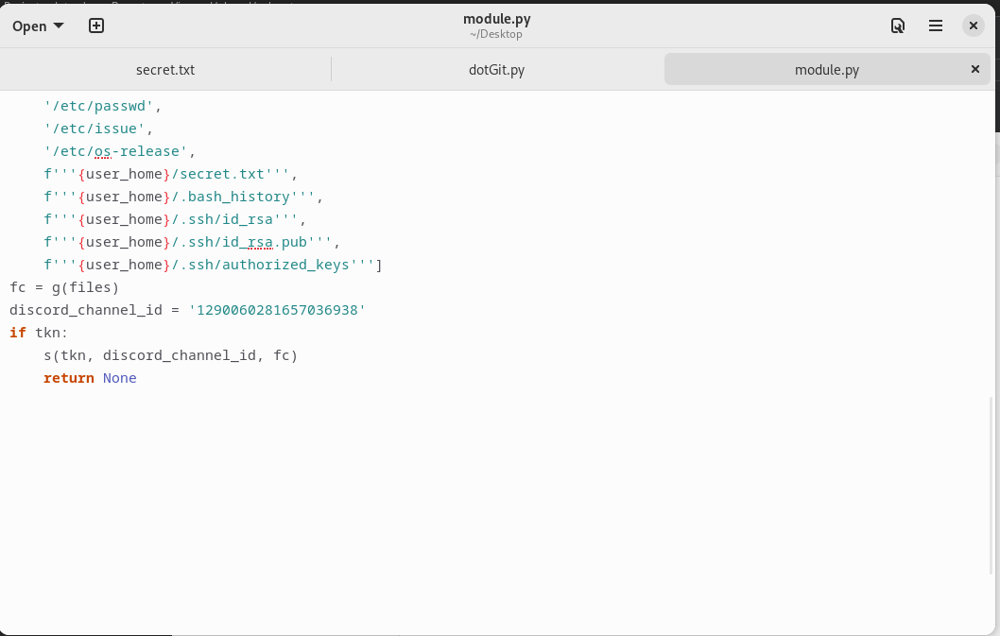  

## Step 4 - Discord operations

 With the ```decrypt.py``` file, we decrypt the hardcoded string and obtain the Bot Token :  
```[REDACTED_DISCORD_BOT_TOKEN]``` (you need to execute ```decrypt.py``` to obtain the key, I couldn't put it in plaintext here... then you need to replace it in the ```messages.py``` at line 4.)     
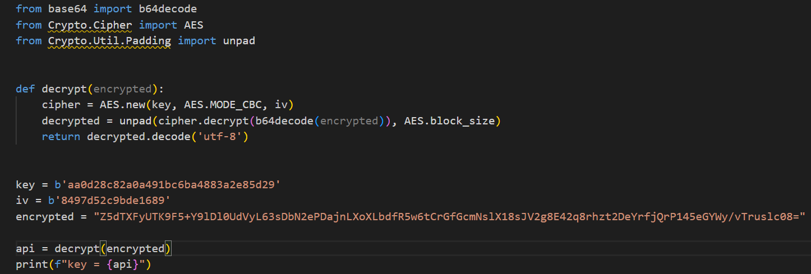

Now, we can send requests to the Discord Server, since we know the channel ID and the bot token. 

Hence, we use the ```messages.py``` script to query the Discord server for past messages.
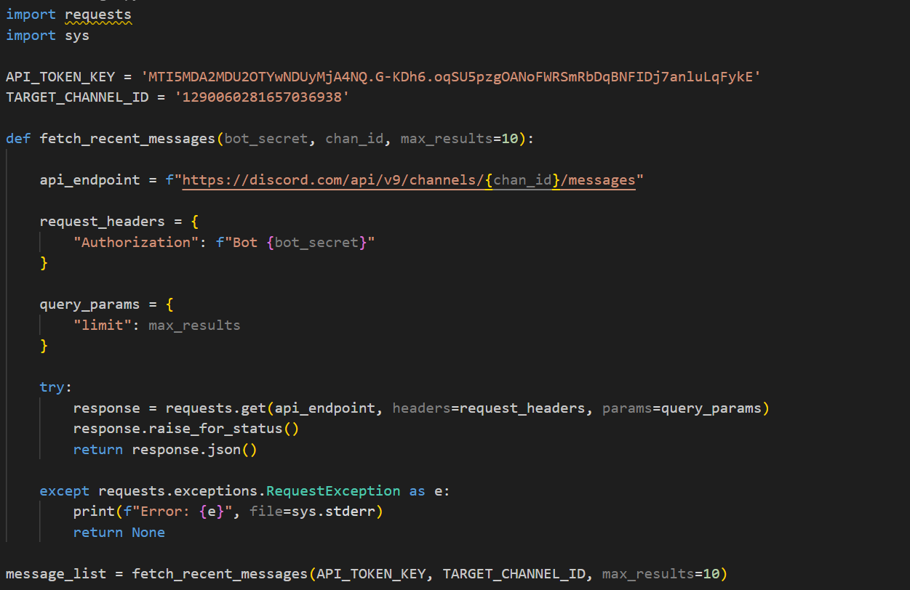  
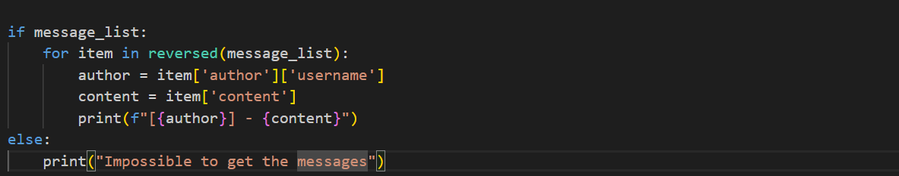

In the output, we can see the interesting part : 
```
Author: Potato - Content: /home/coffinxp/secret.txt
GH{th3_h4ck3r_W4s_H4ck3d_bY_4_haCk3r:(}
```
